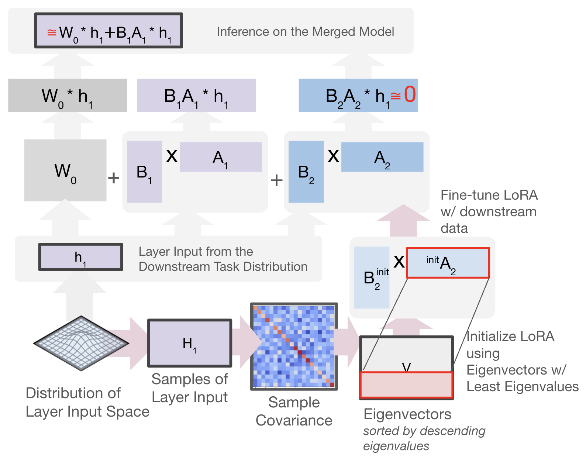

Unraveling LoRA Interference: Orthogonal Subspaces for Robust Model Merging
====================================================

[](https://opensource.org/licenses/MIT)

Official PyTorch Code for Paper: "[Unraveling LoRA Interference: Orthogonal Subspaces for Robust Model Merging](https://arxiv.org/pdf/2505.22934?)" Haobo Zhang, Jiayu Zhou, *ACL* 2025.

## Overview

<!--  -->


> Overview of OSRM, which seeks a data-driven subspace to initiate LoRA fine-tuning and thereby greatly improves model performance when merging multiple LoRA models from different tasks. $W_0$ is the pre-trained weight. $\{B_i,A_i\}$ are LoRA fine-tuned on the $i$-th task. <span style="color: #c5b4f0;">Purple</span>: $(W_0+B_1A_1)*h_1$ is the required output. <span style="color: #93bff1;">Light blue</span>: Decompose the sample covariance matrix to initialize $A_2$. <span style="color: #267ad8;">Dark blue</span>: Reduce the output shift induced by $B_2A_2$.


## Get Started

### Package dependencies
Use `conda env create -f environment.yml` to create a conda env and activate by `conda activate trft`. Major dependencies include `pytorch`, `transformers`, `datasets`, `evaluate`, `accelerate`.

### Quick Demo
To fine-tune `RoBERTa-large` on the GLUE benchmark with OSRM, run
```py3
python3 train_glue.py --backbone roberta-large --init analytical --freeze N --block qv
```
Here are the explanations for the arguments:
- `--backbone`: The pre-trained model to be fine-tuned.
- `init`: The initialization method to be applied. `gaussian` means conventional LoRA initialization, while `analytical` means using OSRM.
- `--freeze`: Which LoRA matrix (`A` or `B`) to be frozen during fine-tuning; setting `N` means no freeze.
- `--block`: Which attention block to be fine-tuned, including `query`, `key`, and `value`.

To train a `RoBERTa-large` model, run 

```py3
python3 train_glue.py --backbone roberta-large --init gaussian --freeze N --block qv --lr 4e-4 --gradient-checkpoint
python3 train_glue.py --backbone roberta-large --init analytical --freeze N --block qv --lr 4e-4 --gradient-checkpoint
```

To train a `Llama3-8B` model, run

```py3
python3 train_glue.py --backbone llama3-8b --init gaussian --freeze N --block qv --load-epochs ./hparams/epoch_1.json --gradient-checkpoint
python3 train_glue.py --backbone llama3-8b --init analytical --freeze N --block qv --load-epochs ./hparams/epoch_1.json --gradient-checkpoint
```

To train a `RoBERTa-large` model with `q, k, v` blocks learnable, run

```py3
python3 train_glue.py --init gaussian --freeze N --block qv --load-lrs ./hparams/lr_qkv.json --load-epochs ./hparams/epoch_qkv.json --gradient-checkpoint
python3 train_glue.py --init analytical --freeze N --block qv --lr 4e-4 --load-epochs ./hparams/epoch_qkv.json --gradient-checkpoint
```

To train a `RoBERTa-large` model with `q` block learnable, run

```py3
python3 train_glue.py --init gaussian --freeze N --block qv --lr 4e-4 --load-epochs ./hparams/epoch_qkv.json --gradient-checkpoint
python3 train_glue.py --init analytical --freeze N --block qv --lr 4e-4 --load-epochs ./hparams/epoch_qkv.json --gradient-checkpoint
```

- `--load-epochs`: Load a pre-defined values of epochs for each task.
- `--load-lrs`: Load a pre-defined values of lrs for each task.

### Merge Fine-tuned Models

We use the code of EMR-merging to merge fine-tuned models: https://github.com/harveyhuang18/EMR_Merging/tree/main.
Please check their repo for more details. 
Thanks to their work.

### Merging Existing Checkpoints

To merging existing checkpoints with OSRM, first run `python3 train_glue.py --backbone roberta-large --init analytical --freeze N --block qv --load-model-path ./load_model_path.json` to transform LoRA modules.
The argument `--load-model-path` should be a `.json` file consisting of directories of checkpoints.

Then apply merging methods in [EMR-merging](https://github.com/harveyhuang18/EMR_Merging/tree/main).

## Conclusion

Our study shows that mitigating interference between data and parameters is critical to model merging.
The proposed OSRM enhances merging performance by reducing such interference via subspace constraint of LoRA.
It also shows robustness to the hyperparameters of merging.

Our study can be applied in broader domains, such as mitigating skill interference in multi-agent systems, reducing conflict in knowledge editing, enabling alignment with different preferences, and building a reasoning model with diverse reasoning paths/styles.

## Acknowledgement
We thank anonymous reviewers for their helpful comments.
This material is based in part upon work supported by the National Science Foundation under Grant IIS-2212174, National Institute of Aging (NIA) 1RF1AG072449, National Institute of General Medical Sciences (NIGMS) 1R01GM145700.

